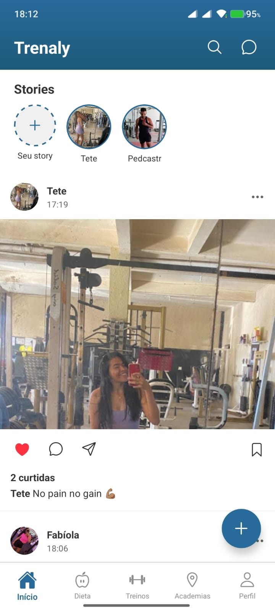
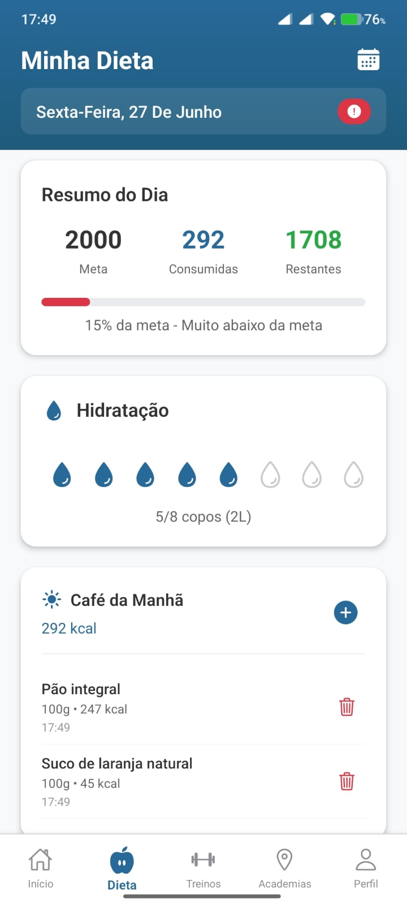
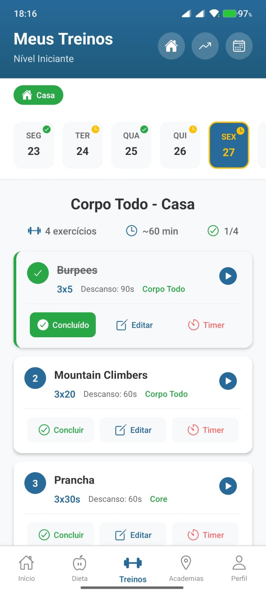
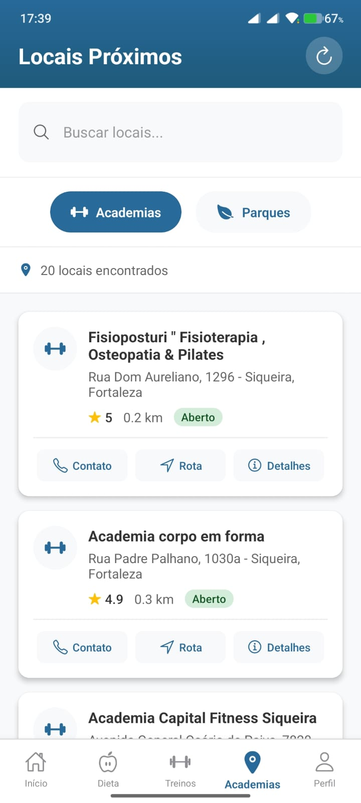

<div align="center">
  
  
  # 🏋️‍♂️ Trenaly
  
  **Seu companheiro completo para fitness e bem-estar**
  
  [](https://reactnative.dev/)
  [](https://expo.dev/)
  [](https://firebase.google.com/)
  [](LICENSE)
</div>

---

## 📱 Sobre o Trenaly

O **Trenaly** é um aplicativo fitness completo que combina rede social, controle nutricional, planejamento de treinos e localização de academias em uma única plataforma. Desenvolvido com React Native e Expo, oferece uma experiência moderna e intuitiva para quem busca um estilo de vida mais saudável.

### ✨ Principais Funcionalidades

- 🏠 **Rede Social Fitness**: Compartilhe seus progressos, stories e interaja com outros usuários
- 🥗 **Controle Nutricional**: Monitore calorias, macronutrientes e hidratação
- 💪 **Planejamento de Treinos**: Crie e acompanhe seus treinos personalizados
- 📍 **Localizador de Academias**: Encontre academias e parques próximos
- 👤 **Perfil Personalizado**: Gerencie suas informações e acompanhe estatísticas

---

## 🚀 Tecnologias Utilizadas

### Frontend
- **React Native** 0.79.4 - Framework principal
- **Expo** 53.0.12 - Plataforma de desenvolvimento
- **React Navigation** 7.x - Navegação entre telas
- **Styled Components** 6.1.19 - Estilização
- **Expo Linear Gradient** - Gradientes visuais
- **Lottie React Native** - Animações

### Backend & Serviços
- **Firebase** 11.9.1 - Backend as a Service
  - Authentication (Autenticação)
  - Firestore (Banco de dados)
  - Storage (Armazenamento de arquivos)
  - Functions (Funções serverless)
- **AsyncStorage** - Armazenamento local

### APIs Integradas
- 🎥 **YouTube Data API v3** - Vídeos de exercícios
- 🗺️ **Google Places API** - Localização de academias e parques
- 🍎 **USDA Food Data Central API** - Dados nutricionais de alimentos

---

## 📸 Screenshots

<div align="center">
  
  
  
  
  
</div>

---

## 🏗️ Estrutura do Projeto

```
trenaly-novo/
├── src/
│   ├── animation/           # Animações personalizadas
│   │   └── index.js        # Splash screen animado
│   ├── assets/             # Recursos estáticos
│   │   └── logo-trenaly.png
│   ├── components/         # Componentes reutilizáveis
│   ├── context/           # Context API (Auth, User)
│   ├── pages/             # Telas do aplicativo
│   │   ├── Diet/          # Controle nutricional
│   │   ├── Gym/           # Localizador de academias
│   │   ├── Home/          # Rede social
│   │   ├── Profile/       # Perfil do usuário
│   │   ├── Search/        # Busca de usuários/posts
│   │   ├── Settings/      # Configurações
│   │   └── SignUp/        # Cadastro de usuários
│   ├── routes/            # Configuração de rotas
│   ├── services/          # Serviços e APIs
│   │   ├── firebaseConfig.js
│   │   ├── placesService.js
│   │   ├── youtubeService.js
│   │   └── nutritionService.js
│   └── utils/             # Utilitários
├── App.js                 # Componente principal
└── package.json          # Dependências
```

---

## 🛠️ Instalação e Configuração

### Pré-requisitos
- Node.js (versão 18 ou superior)
- npm ou yarn
- Expo CLI
- Conta no Firebase
- Chaves de API (YouTube, Google Places, USDA)

### 1. Clone o repositório
```bash
git clone https://github.com/seu-usuario/trenaly-novo.git
cd trenaly-novo
```

### 2. Instale as dependências
```bash
npm install
# ou
yarn install
```

### 3. Configure as variáveis de ambiente
Crie um arquivo `app.config.js` na raiz do projeto:

```javascript
export default {
  expo: {
    name: "Trenaly",
    slug: "trenaly",
    version: "1.0.0",
    extra: {
      // Firebase
      firebaseApiKey: "sua-firebase-api-key",
      firebaseAuthDomain: "seu-projeto.firebaseapp.com",
      firebaseProjectId: "seu-projeto-id",
      firebaseStorageBucket: "seu-projeto.appspot.com",
      firebaseMessagingSenderId: "123456789",
      firebaseAppId: "1:123456789:web:abcdef",
      
      // APIs Externas
      youtubeApiKey: "sua-youtube-api-key",
      googlePlacesApiKey: "sua-google-places-api-key",
      usdaApiKey: "sua-usda-api-key"
    }
  }
};
```

### 4. Configure o Firebase
1. Crie um projeto no [Firebase Console](https://console.firebase.google.com/)
2. Ative Authentication, Firestore e Storage
3. Configure as regras de segurança
4. Adicione as credenciais no arquivo de configuração

### 5. Execute o projeto
```bash
npx expo start
```

---

## 🎯 Funcionalidades Detalhadas

### 🏠 Home (Rede Social)
- **Stories**: Compartilhe momentos do seu treino
- **Feed de Posts**: Veja atualizações de outros usuários
- **Interações**: Curta e comente publicações
- **Busca**: Encontre usuários e conteúdos

### 🥗 Dieta
- **Controle Calórico**: Monitore calorias consumidas vs. meta
- **Macronutrientes**: Acompanhe proteínas, carboidratos e gorduras
- **Refeições**: Organize alimentos por café, almoço, jantar, etc.
- **Hidratação**: Controle de copos de água consumidos
- **Base USDA**: Mais de 300.000 alimentos catalogados

### 💪 Treinos
- **Biblioteca de Exercícios**: Catálogo completo com vídeos do YouTube
- **Planos Personalizados**: Crie treinos baseados no seu objetivo
- **Histórico**: Acompanhe seu progresso ao longo do tempo
- **Vídeos Tutoriais**: Aprenda a execução correta dos exercícios

### 📍 Academias
- **Localização**: Encontre academias e parques próximos
- **Informações Detalhadas**: Horários, telefone, avaliações
- **Navegação**: Integração com Google Maps
- **Filtros**: Academias, parques, centros esportivos

### 👤 Perfil
- **Estatísticas**: Acompanhe seu progresso
- **Configurações**: Personalize sua experiência
- **Histórico**: Veja suas atividades passadas

---

## 🔧 APIs e Integrações

### YouTube Data API v3
```javascript
// Busca vídeos de exercícios
const videos = await youtubeService.searchExerciseVideos('flexão de braço');
```

### Google Places API
```javascript
// Encontra academias próximas
const gyms = await placesService.searchNearbyPlaces(lat, lng, 'gym');
```

### USDA Food Data Central
```javascript
// Busca informações nutricionais
const foods = await nutritionService.searchFoods('banana');
```

---

## 🎨 Design e UX

- **Material Design**: Interface moderna e intuitiva
- **Gradientes**: Visual atrativo com cores vibrantes
- **Animações**: Transições suaves com Lottie
- **Responsivo**: Adaptado para diferentes tamanhos de tela
- **Acessibilidade**: Seguindo boas práticas de UX

---

## 🚧 Roadmap

### Versão 1.1
- [ ] Sistema de seguir/seguidores
- [ ] Chat entre usuários
- [ ] Notificações push
- [ ] Modo offline

### Versão 1.2
- [ ] Integração com wearables
- [ ] Planos de treino premium
- [ ] Nutricionista virtual com IA
- [ ] Desafios e gamificação

### Versão 2.0
- [ ] Versão web
- [ ] API pública
- [ ] Marketplace de treinos
- [ ] Análise avançada de dados

---

## 🤝 Contribuindo

Contribuições são sempre bem-vindas! Para contribuir:

1. Faça um fork do projeto
2. Crie uma branch para sua feature (`git checkout -b feature/AmazingFeature`)
3. Commit suas mudanças (`git commit -m 'Add some AmazingFeature'`)
4. Push para a branch (`git push origin feature/AmazingFeature`)
5. Abra um Pull Request

---

## 📄 Licença

Este projeto está sob a licença MIT. Veja o arquivo [LICENSE](LICENSE) para mais detalhes.

---

## 👨‍💻 Autor

**Seu Nome**
- GitHub: [pedcastr](https://github.com/pedcastr)
- LinkedIn: [Pedro Castro](https://www.linkedin.com/in/pedro-castro-2504471b7/)
- Email: pedrohenriquecastro.martins@gmail.com

---

## 🙏 Agradecimentos

- [Expo](https://expo.dev/) pela excelente plataforma de desenvolvimento
- [Firebase](https://firebase.google.com/) pelos serviços de backend
- [YouTube](https://developers.google.com/youtube) pela API de vídeos
- [Google](https://developers.google.com/maps) pela Places API
- [USDA](https://fdc.nal.usda.gov/) pelos dados nutricionais
- Comunidade React Native pelo suporte

---

<div align="center">
  <p>Feito com ❤️ para a comunidade fitness</p>
  <p>⭐ Se este projeto te ajudou, considere dar uma estrela!</p>
</div>